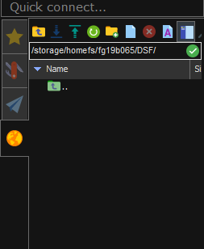

##### Questions
For the questions see background_questions_midterm_project.ipynb
##### Task 3
1. The training set is the part of the data that is used to train the model. In the case of the kinase data we used 70% of the data, which means the training set contains about 125'000 datapoints.
2. The kinase dataset only contains the IC50 value and not the pIC50 value. Therefore to use the data with the code from the tutorial, the pIC50 value has to be calculated first. Since the dataset contains entries where the IC50 is zero, taking the log results in an infinite value. These were dropped before training the model.
3. The test set in our case consists of the 30% of the data we did not use to train the data. Test sets are used to evaluate the performance of the trained model by comparing the predicted values to the actual values in the test set. There are also validation sets, which are used to tune the hyperparamters of a given model. In our case we did not use a validation set.
4. See the .ipynb file.

##### Task 5

1. Ubelix is the high performance computing (HPC) cluster at the University of Bern. It consists of around 320 compute nodes. These computational resources can be used by students and employees for theses, projects, research etc.
2. Anybody with a Campus Account can use the cluster. To do so the Account has to be activated first by sending a request [here](https://serviceportal.unibe.ch/hpc). After the account is activated one can simply establish an SSH connection to one of the submit nodes from within the university network.
3. Jobs can be submitted via bash scripts and the command `sbatch` like this:
```
sbatch myjob.sh
```
The command `sbatch` also takes several arguments to specify how the job should be run. One can for example specify how long the task can run or that an email is sent once the job has been completed. 
4. Anybody with a campus account has access, i.e. students and staff. Furthermore external researches who collaborate with the University of Bern can apply for a campus account and gain access.
5. Ubelix provides both storage and computational resources. In addition, workspaces can be created to facilitate collaboration within research projects.

##### Task 6

For running the relevant code on Ubelix, the .ipynb file was converted to a python file and the parts not needed for the training step were deleted. The part for determining the best batch size was also omitted. The kinase dataset also includes information about the target kinase of each chemical compound. Since the pI50 value depends on the target kinase, this information was also included in the training of the neural network. To do so the CHEMBL ID was converted to a binary array, then the binary representations of the ID and the structure were concatenated.
Trying to open the data directly via an URL was not possible from Ubelix, thus the data was downloaded and transferred to the cluster as well. This meant the part for opening the file had to be adapted a bit (see the python script in this directory).
Transferring the data and the script was quite easy, since with MobaxTerm file transfer can be achieved by simply dragging and dropping the desired files. Below, the Mobaxterm file explorer sidebar, where files can be dragged to transfer.



##### Task 7

As described above the files were transferred to the submit node. The python script, the shell script for submitting and the saved parameters can all be found in the same directory as this markdown file. 
One of the problems encountered when trying to run the script was that the TensorFlow module did not work together with the Python and the Sci-Py module. Therefore, in the submit script only the Python module is loaded and the other necessary packages are installed with pip.
